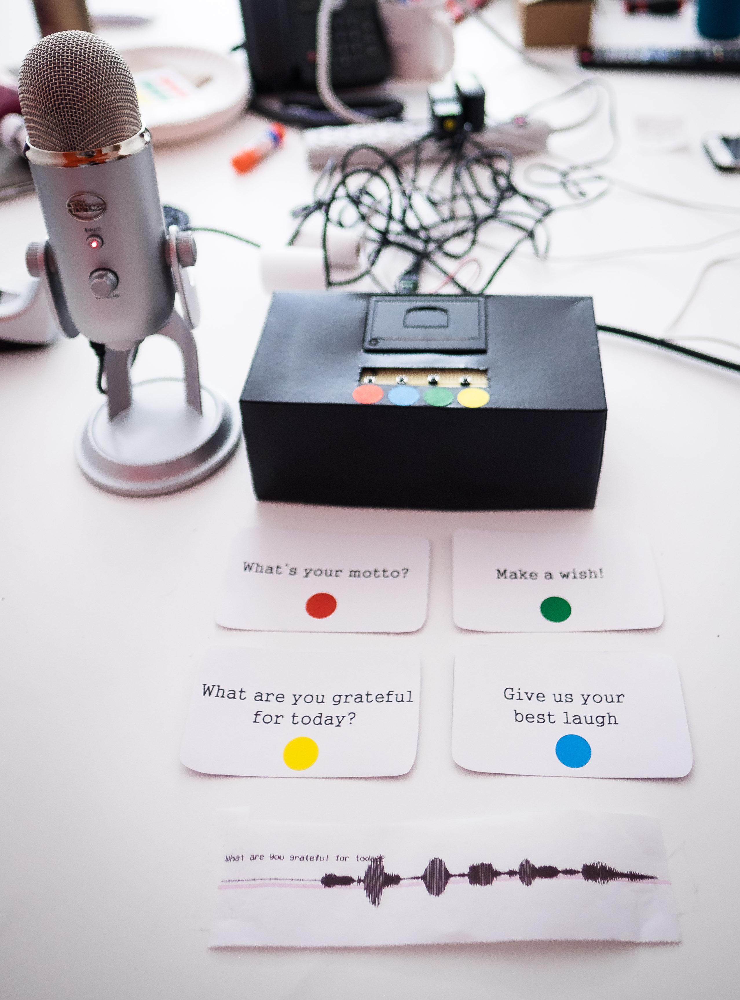
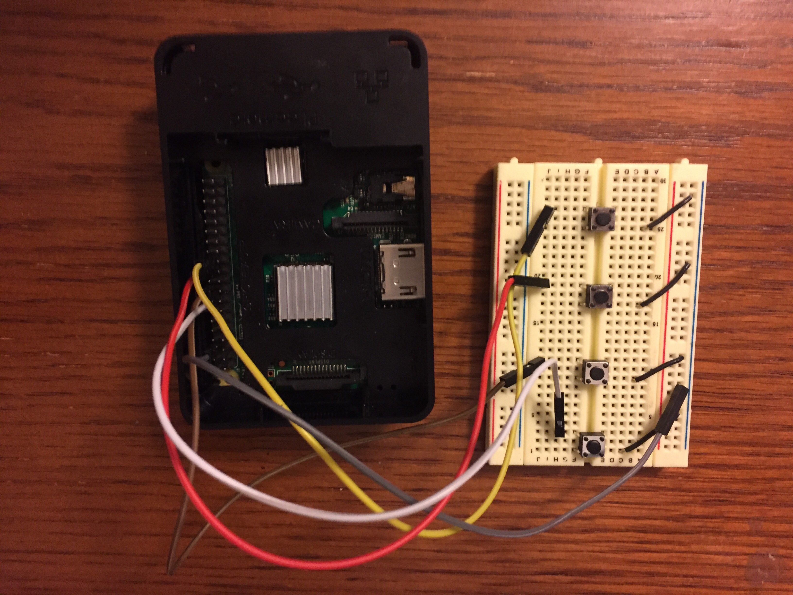
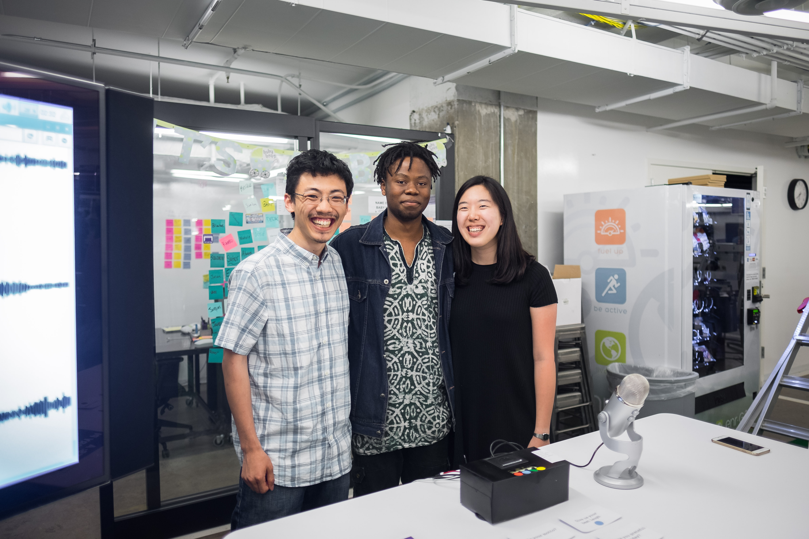

# Waves

*Waves* is a Raspberry Pi project centered around transforming the transience of the spoken word into something concrete and physical. In our setup, a user presses a button corresponding to a question, answers it into a microphone while pressing down on the button, and then receives a receipt of the audio waveform in return. The audio waveform is also sent to a webpage, where it is displayed among the other responses that have been collected so far.

## Components

Want to set this up on your own? Good news then - this is a fairly simple project to put together! The main components you need are:

1. A Raspberry Pi
2. Thermal Printer (you can get one from Adafruit)
3. A few push buttons (one for each question)
4. A breadboard and some wires
5. A USB microphone
6. Python
7. A Kleenex Box, or some other container (optional)
8. HDMI cable / mouse / keyboard (optional)
9. A couple of good friends (not-optional)

## Setup

### Setting up the hardware

Once you have the hardware components listed above, putting it together is pretty straightforward. Connect the USB microphone and the Thermal Printer to the Raspberry Pi, and you're halfway there! Getting the printer properly set up with the Raspberry Pi software can be a bit tricky - we followed [this tutorial here](https://learn.adafruit.com/networked-thermal-printer-using-cups-and-raspberry-pi/connect-and-configure-printer), which should get you through most of the process. 

After that, all you need to do is hook up the push buttons to the Raspberry Pi. We had four buttons, one for each question, though you can add more if you want. One end of the button should be connected to Ground, and the other end should be connected to a GPIO pin on the Pi. We used pins 8, 23, 24, and 25 - you can see what that looks like below.

### Setting up the code

To get the code working, you can first clone our repository. We require a few dependencies: time, matplotlib, FFMPEG, PIL, subprocess, and Flask. To get those working, just run `pip install dependency`.

After that, you just need to run 

`python controller.py` 

to get the main script working, and run

`python app.py`

to get the server to run on the webpage (localhost: 5000)

#### How the code works

What `python controller.py` does is to constantly read the button states from the Raspberry Pi; and once it detects that a button has been pushed, it records the audio from the USB mic using the linux `arecord` function. Then, it launches the script `killer.py` in a separate process, which detects when the button has been released and subsequently kills the arecord command, since there's not really any other way to stop the recording process. After the recording has terminated, it saves the recording (and overwrites, if it already exists) to the file `audio.mp3`. Once the recording has been saved, the script `viz.py` is launched. This script takes the audio file, and using python matplotlib magic, turns it into a nice lil waveform image. A timestamp is appended at the end of the filename, and it's stored in the static/images folder. The final step is at the end of viz.py - a command called `lpr` sends the file to be printed by your thermal printer, whereupon you get your receipt - pretty cool, right?

What `python app.py` does is to run a server to store and retrieve the generated waveform images. We used a Flask server to send the most recent image file in the static/images file to a /images endpoint. Then, in the templates/index.html file, an AJAX call retrieves the image at that endpoint every second, and if it's not already collected, it takes the image and appends it to the end of the webpage.

### Putting it together

That's pretty much it! You can put all the components in a box and spray paint it to look nice, or you can just leave it bare. There's a lot of potential for improvement, in terms of physical design and scope and such, but we're pretty happy with how it is right now. If you have any questions/comments about this, or decide to build it yourself, let us know!

---

Built by Bomani, Eunice, and Matt <3

